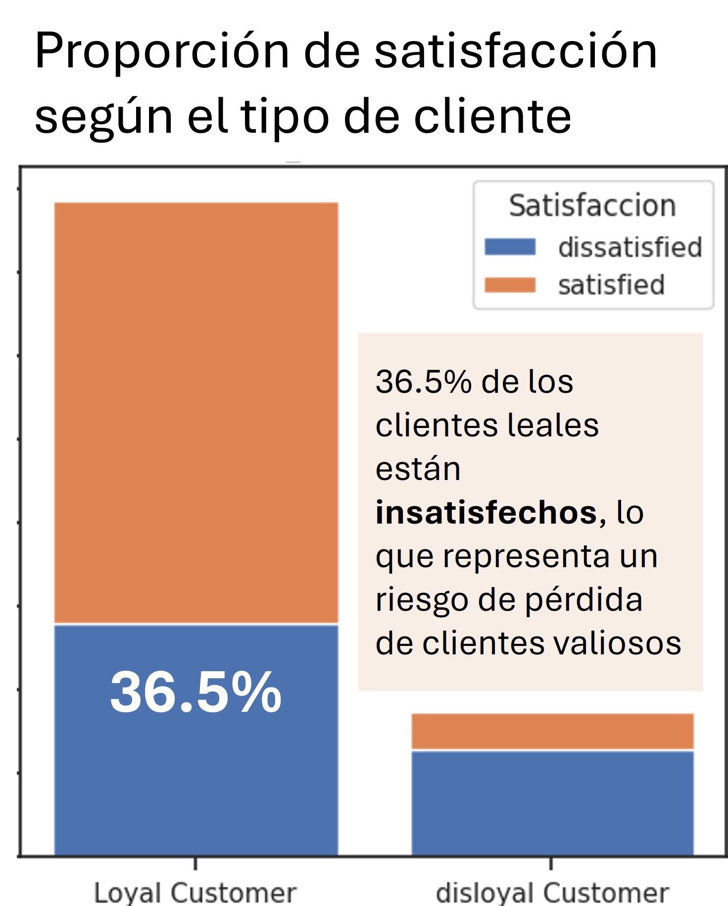

# Predicción de insatisfacción de clientes en una aerolínea
## Herramientas utilizadas
- Python: Pandas, Scikit‑learn, Matplotlib, Seaborn

# Resumen
Este proyecto utiliza Python y Machine Learning para **identificar clientes con alta probabilidad de insatisfacción** a partir de datos de encuestas y características del vuelo. El proyecto identifica una brecha entre lealtad y satisfacción (solo 63.5% de los clientes leales están satisfechos) y propone un modelo predictivo con el objetivo de apoyar decisiones de marketing y retención, permitiendo a la aerolínea actuar de forma proactiva sobre clientes en riesgo.

## Contexto del negocio
El análisis exploratorio reveló una situación relevante:

- El 81.7% de los clientes son considerados leales.
- Sin embargo, solo el 63.5% de ellos se declara satisfecho

Este desbalance sugiere un riesgo: clientes valiosos que podrían abandonar la aerolínea si no se detectan y gestionan a tiempo.

En ese sentido, se propone contar con una herramienta analítica que anticipe la insatisfacción de los clientes y permita diseñar acciones proactivas y reactivas, optimizar recursos y mejorar la experiencia general del cliente.

## Objetivo del proyecto
Desarrollar un modelo analítico que permita **predecir la insatisfacción de los clientes**, con el fin de:

- Apoyar la **segmentación de clientes**
- Facilitar **estrategias de marketing y comunicación personalizadas**
- Contribuir a la **retención y mejora de la experiencia de vuelo**

## Enfoque analítico
- Análisis exploratorio de datos (EDA) para identificar patrones y factores clave
- Limpieza y preparación de datos (valores faltantes, outliers, codificación de variables)
- Definición de un **baseline** para comparación
- Entrenamiento y evaluación de modelos de clasificación
- Selección del modelo priorizando el **impacto en el negocio**
- Evaluación final en datos no vistos (conjunto de test)

## Principales insights
- Los **clientes leales** representan una proporción significativa de clientes insatisfechos
- La **clase Economy** concentra el mayor nivel de insatisfacción
- Los **servicios a bordo** (entretenimiento, comodidad del asiento, WiFi) influyen fuertemente en la satisfacción
- Los **clientes más jóvenes** tienden a presentar mayores niveles de insatisfacción
Estos resultados permiten identificar oportunidades concretas de mejora en la experiencia del cliente.

## Modelado
Se entrenaron y compararon distintos modelos de clasificación (Regresión Logística, KNN, Árbol de Decisión y Random Forest). La selección final se basó en un criterio alineado al negocio:

- Se priorizó minimizar los falsos negativos, es decir, clientes insatisfechos no detectados
- El Árbol de Decisión fue seleccionado por:
  * Alto recall para la clase “cliente insatisfecho”
  * Buena interpretabilidad
  * Menor complejidad computacional

## Resultados
- El modelo final muestra una **mejora significativa respecto al baseline** (recall: frente a ), especialmente en la identificación de clientes insatisfechos.
- Identificar clientes con riesgo de insatisfacción
- Activar campañas proactivas de retención
- Priorizar mejoras en aspectos clave del servicio
- Apoyar decisiones de marketing basadas en datos
  
El análisis exploratorio, el entrenamiento de modelos y la evaluación detallada se encuentran disponibles en el notebook del repositorio.
